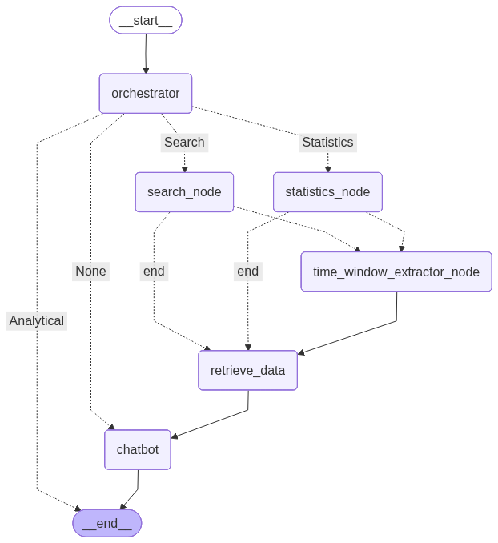

# dena-task project
dena-task is a conversational AI agent built to handle company tasks in a natural language interface.

## 1.Features
- Handles multi-turn conversations
- Reads data base (.csv) file via an API call from  http://127.0.0.1:8008/search end point.
- Reports Statistics data and Searchs for queries from user input message.
- Uses a workflow conversation management technique to evaluate user intent (search or statistics), extract query entities (e.g. full name, department, time window), and then retrieves data and reports back. 
- Stateful Conversations, keeps all the human and responses related to each session in a conversation via agent State. 
- FastAPI-based HTTP endpoints for integration and error handling

## 2. General architecture of the agent is as follows:


## 3.Project Structure:
```text

dena-task/
├── agent_src/
│   ├── __init__.py
│   ├── agent.py              # Main agent graph compilation and interfaces
│   ├── basemodels.py         # Pydantic models for LLM output structure
│   ├── llm_definition.py     # GroqAI LLM initialization and configurationI used GroqAI playground cloud service, First, its FREE,
│   │                             second, powerfull models available. I used gpt-oss-120B. Very good understanding of the Persian language, │   │                             and Fast. It is a Mixture-of-Expert model.
│   ├── logger.py             # logging the chatbot output.
│   ├── nodes.py              # Agent graph nodes implementation
│   ├── prompts.py            # System and user prompts for LLM
│   ├── tools.py              # Tool definitions for agent (in development), no tool use implemented for Search and Statistics tasks. Will be 
│   │                             added next.
│   └── utils.py              # Helper functions (date parsing, formatting)
├── dataset/
│   └── main.py               # Dataset API and data filtering logic
│   └── data_prep.py          # Dataset merging and tests on data
├── logs/                     # Agent interaction logs
├── main.py                   # FastAPI application and REST endpoints
├── test_agent.ipynb          # Jupyter notebook for testing and experimentation
├── requirements.txt          # Python dependencies
├── .env                      # Environment variables (API keys) (excluded from git for security purposes)
├── .gitignore
├── image_graph.png           # Architecture diagram
└── README.md
```

## 4. Dataset Configuration
The agent uses task data from a CSV file. Searching the data file includes the following columns:

status: Task status (open, closed, in_progress, etc.)
priority: Task priority (critical, high, medium, low)
fullname: Name of the person assigned
department: Department name
assignee_id: Unique identifier for assignee
create_year, create_month, create_day: Task creation date components, when given, all values AFTER these parameters are retrieved.

Note: The dataset module is still under development and may require additional configuration.

## 5. Configuration
1. Set up your GroqAI API key
Create a .env file in the project root with your GroqAI credentials:

Create a `.env` file in the project root with your GroqAI credentials:

```env
api-key = "your_groq_api_key_here"
base-url = "https://api.groq.com/openai/v1"
```

To get a free API key:

Visit console.groq.com
Sign up or log in
Navigate to API Keys section
Generate a new API key
Copy and paste it into your .env file

## 6. Usage
6.1. Create a virtual environment using Anaconda (recommended)
* Running the Agent API Server
```bash
# Start the FastAPI server on localhost:8000
uvicorn main:app --host 127.0.0.1 --port 8000
```
The server will be available at http://localhost:8000

* Running the data bese API server 
```bash
# Start the FastAPI server on localhost:8008
uvicorn main:app --host 127.0.0.1 --port 8008
```
The server will be available at http://localhost:8000


## Some Demo outputs from logs file:
2026-06-04 01:40:26,864 [Agent] [INFO] Graph response: {'messages': [HumanMessage(content='تسکهای باز محمد رضایی را نشان بده', additional_kwargs={}, response_metadata={}, id='4abb1b17-8380-43f5-9ac3-2b9447e16b54')], 'user_intent': 'Search', 'search_criteria': {'status': 'Open', 'fullname': 'محمد رضایی'}}


2026-06-04 16:39:54,148 [Agent] [INFO] Graph response: {'messages': [HumanMessage(content='چند تسک حیاتی تو دوماه گذشته داریم؟', additional_kwargs={}, response_metadata={}, id='e187632b-dd4a-4562-9628-b1333108e5aa')], 'user_intent': 'Statistics', 'search_criteria': {'time_window': 'دوماه گذشته', 'priority': 'Critical'}}


2026-06-04 17:47:35,559 [Agent] [INFO] Graph response: {'messages': [HumanMessage(content='چند تسک حیاتی تو دوماه گذشته داریم؟', additional_kwargs={}, response_metadata={}, id='71aede88-01a1-481c-8f75-9b0293ec7d5b')], 'user_intent': 'Statistics', 'search_criteria': {'time_window': 'دوماه گذشته', 'priority': 'High'}, 'time_window': {'days': 0, 'months': 2, 'years': 0}}
2026-06-04 18:04:07,310 [Agent] [INFO] Graph compiled successfully.

## In this example, the actual date is extracted. Month from 6 to 4. 
2026-06-04 18:04:14,178 [Agent] [INFO] Graph response: {'messages': [HumanMessage(content='چند تسک حیاتی تو دوماه گذشته داریم؟', additional_kwargs={}, response_metadata={}, id='9bff2d6e-1e70-4217-b582-78f78cce4c30')], 'user_intent': 'Statistics', 'search_criteria': {'time_window': 'دوماه گذشته', 'priority': 'Critical'}, 'time_window': {'day': 4, 'month': 4, 'year': 2026}} 

